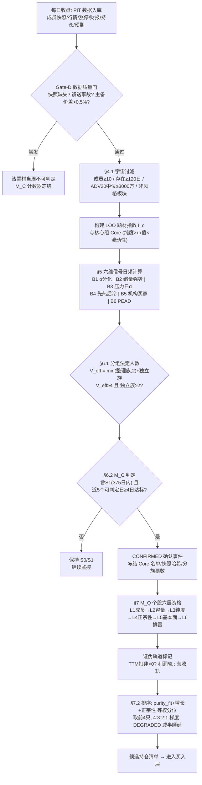
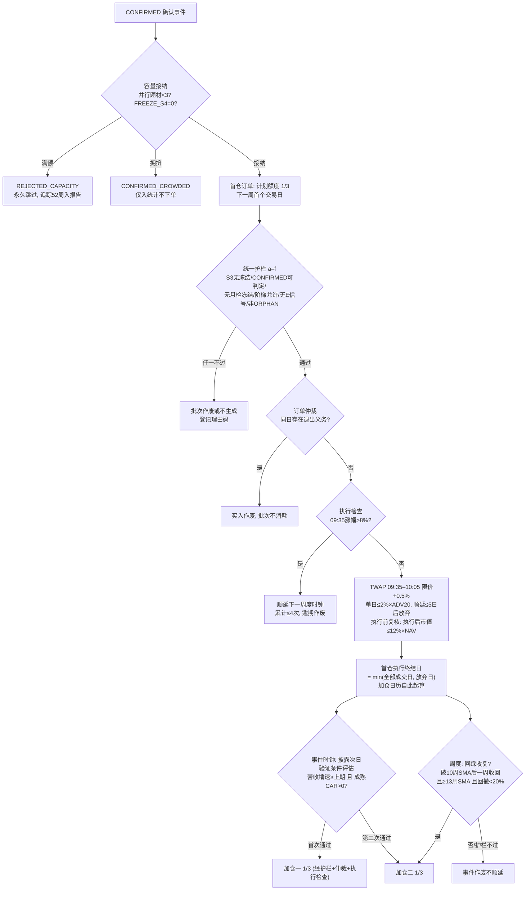
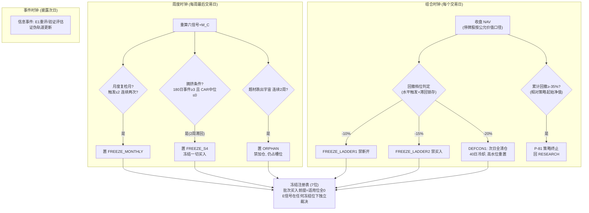
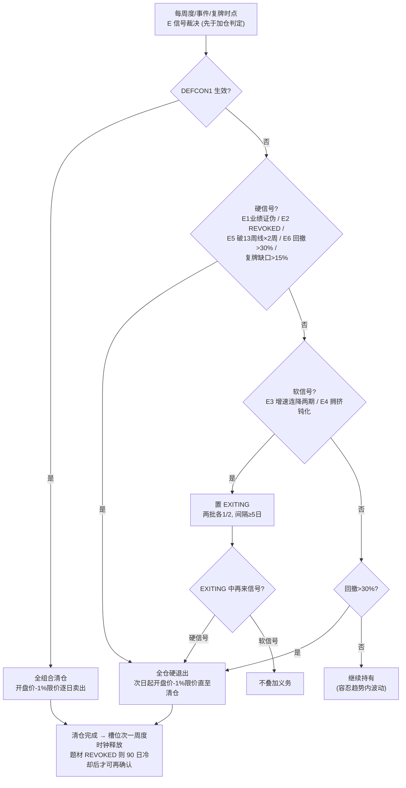
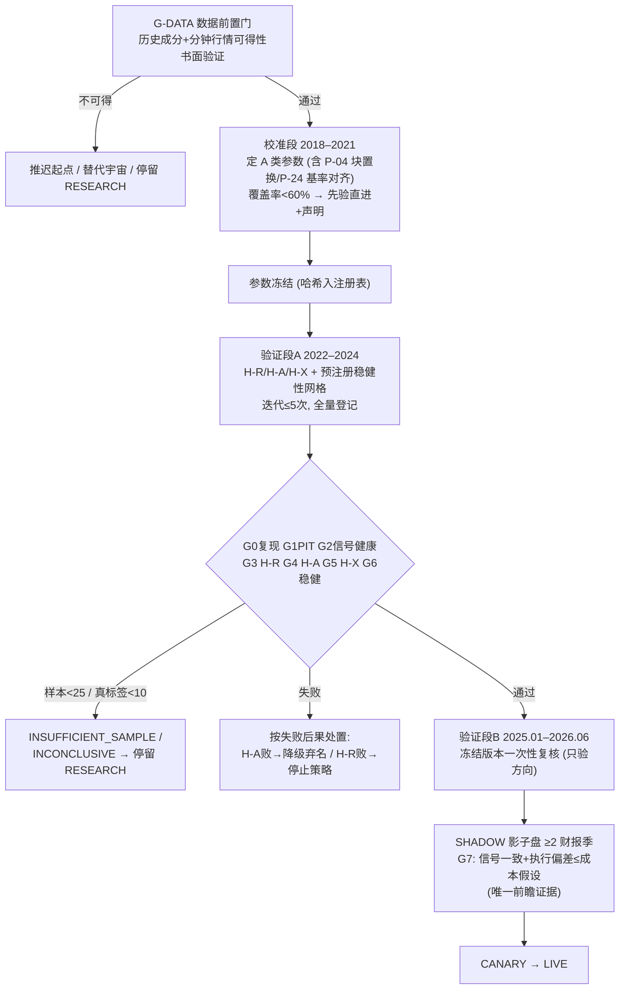
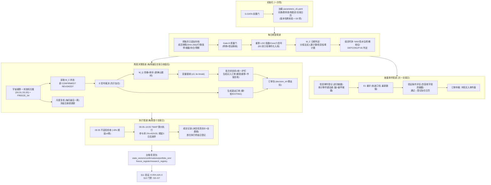
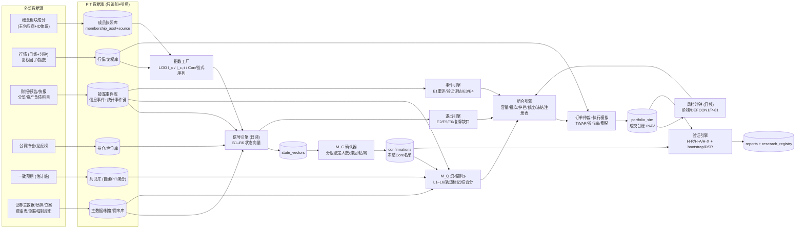

# SFL-2 v5.0 逻辑链路解析与流程图
## 选股层 → 买入条件 → 持仓管理 → 卖出条件 → 收益分析

> 解析对象：《SFL-2 v5.0 产业时钟·中军趋势策略 SPEC（可回测版）》（同仓库）
> 日期：2026-08-27
> 本文是 SPEC 的**解读文档**，不新增任何规则；所有条款引用以 v5.0 SPEC 原文为准。图示采用 Mermaid。

---

## 0 一句话总览

策略在做一件事：**在概念题材"被情绪资金炒热、又冷静下来"之后，用六个行为学信号侦测"定价权是否已从短线资金移交给配置型资金"（M_C 确认器），确认后买入题材内部"筹码承接力最强、业务最正宗"的 4 只中军（M_Q 资格排序），按"财报验证一次、加一批仓"的节奏持有 1–4 个季度，用六类退出信号（业绩证伪/政权回退/增速拐点/拥挤钝化/趋势破位/深度回撤）离场，全程受组合级回撤阶梯与熔断保护。**

时钟结构（§2.1）：

| 时钟 | 频率 | 职责 |
|---|---|---|
| 周度时钟 | 每周最后交易日收盘后 | 算信号 → 确认判定 → 选股排序 → 生成下周订单 |
| 事件时钟 | 每次财报类披露的次一交易日 | E1 业绩证伪重评、季报验证事件评估（加仓触发源） |
| 组合时钟 | 每个交易日收盘后 | NAV、回撤阶梯、DEFCON1、P-81 终止线 |

信号本身（B1–B6、M_C）**日频**计算入库；周度时钟只是"读数并下单"的决策时点。

---

## 1 第一层：选股层

选股是**两级漏斗**：先选题材（哪个板块发生了政权交接），再选个股（板块里谁是中军）。

### 1.1 题材漏斗（宇宙 → 情绪前科 → 六信号 → 确认）

**第 1 级：宇宙过滤（§4.1）**——每周重算，全自动、禁止人工增删：

- 沪深概念板块（剔北交所）；有效成员 ≥10 只；板块存在 ≥120 交易日；成员 ADV20 中位数 ≥3000 万元；非纯风格/资金面板块（版本化排除词典）。
- 数据基础是**每日只追加存档的 PIT 成员快照**（§3.2）：用今天的成分表回测历史 = 未来函数，这是全框架的最高优先级资产；历史区段不可验证的标记 `MEMBERSHIP_UNVERIFIED`，不进收益统计。

**第 2 级：情绪前科（§4.2 S1）**——"没热过的板块不存在交接"：

- S1 判定：60 日涨停密度 ZTD ≥0.75/成员（涨停股·日总数 ÷ 日均可计入成员数；20cm 涨停按 P-24=3.0 折算，ST/次新/退市整理不计入），**或** LOO 题材指数 20 日收益 ≥+25%；
- S1 是**事件型前科记录**，M_C 确认要求"375 个交易日内曾触发 S1"。

**第 3 级：六维行为状态向量（§5）**——全部日频、{1, 0, NA} 三值，基于**自建 LOO 等权题材指数**（不用数据商指数）与**核心组 Core**（purity_exp 前 1/3 ∩ 市值前 40% ∩ ADV20 前 40%，逐日重算链式序列）：

| 信号 | 测什么 | 核心判定（口语化） |
|---|---|---|
| B1 纯度分化 | 资金是否聚焦龙头（α 分化） | 对每股回归 \(r_i=\alpha+\beta I_{c,-i}+\varepsilon\)（60 日窗、跳过最近 5 日），purity_exp=max(β,0)·R²；按纯度分三组，高低组**特质收益**（β 对冲后）之差 60 日累计 ≥6% 且还在扩大 |
| B2 换手沉淀 | 缩量不缩价（筹码锁定） | Core 20 日均换手 ≤ 历史 120 日峰值的 70%，且价格指数 ≥ 250 日高点的 90% |
| B3 抗跌强度 | 压力日 α（大跌日抗跌） | 中证1000 跌 ≥1% 的调整日上，Core 的 **β 对冲后**超额均值 >0 且处于自身历史 80 分位以上；调整日不足时切换"题材跌 ≥2%"备用口径（对 LOO 指数 β 对冲） |
| B4 梯队毕业 | 先热后冷（情绪退潮但价格不退） | 近 20 日涨停几乎清零（原始计数 ≤max(1,⌊0.05N̄⌋)）∧ 前 60 日曾密集涨停（折算密度 ≥0.25/成员）∧ 20 日价格收益 ≥0 |
| B5 买家结构 | 配置型资金进场证据 | 公募持仓占比同口径连续两期上升（全持仓轨 > 前十大轨 > 题材级龙虎榜机构净买），经常 NA 属预期 |
| B6 业绩定价 | 市场是否为业绩付钱（PEAD） | 180 日内去重后的成熟业绩事件 ≥3 个、覆盖 ≥2 只成员，事件 CAR(0,+5)（相对 LOO）中位 >0 且近 20 日均值 >0 |

**第 4 级：M_C 交接确认器（§6）**——分组法定人数防"相关选票"：

- 信号分两族：整理族 {B1,B2,B4}（同源，**至多计 2 票**）、独立族 {B3,B5,B6}；
- 有效票 \(V_{eff}=\min(c_{cons},2)+c_{indep}\)；**法定人数 = \(V_{eff}\ge4\) 且独立族 ≥2 票**；非 NA 信号数 <4 当日不可判定；
- **CONFIRMED**：曾 S1（375 日内）∧ 最近 5 个可判定日中 ≥4 日满足法定人数（仅毛刺过滤，统计上按单日事件处理）；
- **REVOKED**（两条通道）：①证据反向——5 个可判定日中 ≥4 日满足反向法定人数（\(V_{eff}\le n_{av}-4\)）；②信息枯竭——确认后连续 20 个交易日不可判定；
- 90 自然日冷却期内同一题材至多确认一次。

确认事件冻结输出：确认日、成员快照哈希、**冻结 Core 名单**、六信号轨迹、分族票数——这是后续所有统计检验的原子事件。

### 1.2 个股漏斗（M_Q 六层资格 + 排序，§7）

对已确认题材的成员逐层过滤：

| 层 | 门槛 | 不可得处理 |
|---|---|---|
| L1 成员 | 在 PIT 快照中（快照日 ≤ t） | 硬条件 |
| L2 容量 | 自由流通市值与 ADV20 均簇内前 40%（中军必须装得下钱） | 硬条件 |
| L3 纯度 | purity_exp ≥ 簇内中位 ∧ 与题材指数相关 ≥0.60（同窗 [t−65,t−6]） | 硬条件 |
| L4 正宗性 | 题材相关分部收入占比 ≥10%（版本化分部词典） | 不可得 → DEGRADED，仓位上限减半 |
| L5 基本面预期 | 三选一：营收累计同比 >0 / 一致预期营收或 EPS 同比 >0（≥3 家覆盖）/ 合同负债或在建工程环比 ≥+30% 且占总资产 ≥5% | 全不可得 → DEGRADED |
| L6 排雷 | 非 ST、上市 ≥250 日、无立案调查、大股东质押 <50% | 硬条件 |

- 每只通过者打**证伪轨道标记**：TTM 扣非 >0 → 利润轨，否则 → 营收轨（决定 E1/E3/E4 用利润口径还是营收口径证伪——0→1 阶段的亏损公司也能被证伪，入口与出口对齐）；
- **排序**：综合分 = purity_fit（R²）、增长（一致预期营收增速 → 披露营收同比 → 缺失取中位+DEGRADED）、正宗性 三个簇内分位**等权平均**（权重冻结）；
- 取前 4 只，按 **4:3:2:1** 分配题材内仓位；DEGRADED 减半，被削减额度顺延给下一名合格者。

### 1.3 选股层流程图

---

## 2 第二层：买入条件

### 2.1 容量接纳（§8.1）

- 并行题材 ≤3 个；超容量时**先确认先得**（同日确认按题材成员 ADV20 合计降序、再按 board_id 字典序）；
- 满额时新确认题材记 `REJECTED_CAPACITY`，**永久跳过**（无等待队列——显式选择偏差优于隐式），其后续 52 周表现追踪入报告；
- 确认日已处拥挤冻结（FREEZE_S4）的事件记 `CONFIRMED_CROWDED`，只进统计、不下单、不占槽位。

### 2.2 三批建仓与批次状态机（§8.1）

| 批次 | 触发 | 仓位 |
|---|---|---|
| 首仓 | 确认后的下一周首个交易日 | 计划额度 1/3 |
| 加仓一 | 该股自身**首次通过验证的披露事件**成熟后 | 1/3 |
| 加仓二 | 第二次验证事件成熟，**或**回踩收复事件（先到者为准） | 1/3 |

- **季报验证事件** = 披露期营收累计同比增速 ≥ 上一披露期 **且** 该披露的 CAR(0,+5)>0（相对 LOO 指数）——"报表好且市场认账"双条件，防自我叙事；评估在**信息事件层**逐次披露执行（预告无营收不参与，快报/正式报告参与），每报告期至多"通过"一次；CAR 判定必须等事件成熟日（披露后第 6 个交易日）；
- **加仓日历自首仓执行终结日起算**（= min(全部成交日, 顺延放弃日)），此前的披露不计入批次；
- **回踩收复事件**：周收盘跌破 10 周 SMA 后下一周收回其上，且收复周收盘 ≥13 周 SMA、持仓期回撤 <20%（接飞刀护栏）；不满足即作废不顺延；
- **统一护栏**（任何批次执行前逐项检查）：a) S3 且 FREEZE_S4=0；b) CONFIRMED 且最近周度时钟可判定；c) FREEZE_MONTHLY=0；d) 回撤阶梯档位允许；e) 无任何 E 信号（E 判定先于加仓判定）；f) 非 ORPHAN。冻结期内成熟的事件**作废不顺延**。

### 2.3 执行纪律（§8.2）与订单仲裁（§2.1）

- 单股计划额度 = min(梯度份额 × min(30%NAV, 题材剩余额度), 12%NAV（DEGRADED 6%）, 5 日 × 2%×ADV20)，各批次触发周重算；**执行前再验一次"执行后市值 ≤12%×当前 NAV"**（执行层不变量）；
- 执行：下周首个交易日 09:35–10:05 TWAP 基准价，限价 +0.5%；单日成交 ≤2%×ADV20，顺延最多 5 个交易日后**放弃**（放弃部分不补）；
- 不追高：09:35 涨幅 >8% 整批顺延至下一周度时钟重估，累计顺延 ≤4 个周度时钟后作废；
- 一字涨停/停牌按实际记录，禁止理论价回填；
- **订单仲裁**：同日同证券"买入 × 任何退出义务"→ 买入作废、批次不消耗，仅执行退出；多源退出按 DEFCON1 > 硬 > 软合并。

### 2.4 买入层流程图

---

## 3 第三层：持仓管理

持仓期间有**四套并行的管理机制**，全部通过统一的**冻结注册表**（7 个冻结位）作用于"能否继续买入"，而**个股去留永远只由 E 信号裁决**（解耦原则）。

### 3.1 题材级健康监控

- **月度复检（§9.3）**：每月最后一个周度时钟重算六信号，可判定且触发数 ≤2、连续两次 → 置 FREEZE_MONTHLY（冻结加仓）；连续两次恢复即解除；顺延上限 4 周；
- **拥挤监控（FREEZE_S4）**：近 180 日成熟事件 ≥3 且 CAR 中位 ≤0（业绩利好开始钝化）→ 冻结一切批次买入，2 周滞回；
- **ORPHAN 管理态（§10.1）**：持仓题材连续 2 周跌出宇宙 → 禁加仓，信号按最后合规快照续算（仅供撤销判定），仍占槽位与暴露直至清仓；
- **信息枯竭**：确认后连续 20 个交易日不可判定 → 自动 REVOKED → E2 清仓。

### 3.2 个股级维护

- **证伪轨道滚动更新**：每次披露后重判 TTM 扣非正负，利润轨/营收轨切换记录 decision_id；
- **停牌/复牌（§9.4）**：停牌期 E 信号冻结、按停牌前价计 NAV；停牌 >60 交易日改按 LOO 指数联动的公允价值口径（仅用于风控判定）；复牌首日缺口 >15% 视同 E6 硬退出，否则次日重估全部 E 信号；填充周不计入 E5 的"连续 2 周"。

### 3.3 组合级风控（§10.2，日频组合时钟）

| 档位 | 触发（相对高水位） | 动作 | 解除 |
|---|---|---|---|
| 一档 | −10% | 禁新开题材（存量加仓仍可） | 收窄至 −7% |
| 二档 | −15% | 禁一切批次买入 | 收窄至 −12% |
| DEFCON1 | −20% | **清仓全部持仓（无视 E 信号）**，40 交易日冷却 | 复位规则 |
| P-81 终止线 | 相对**策略起始净值** −35% | 策略终止，回 RESEARCH，不得原参数重启 | 终局 |

- DEFCON1 复位：清仓完成日高水位重置、档位清零、冷却期内视同二档且 DEFCON 判定挂起；冷却期满仍 CONFIRMED 的题材可重走首仓流程；
- P-81 以策略起始净值为基（**不随 DEFCON 重置**），封顶连环熔断的累计亏损；
- 一致性验算：3 题材 ×30%×(−30%) = −27% > −20% 预算，所以阶梯必须在途中拦截，熔断是兜底。

### 3.4 持仓管理流程图

---

## 4 第四层：卖出条件

### 4.1 六类退出信号（§9.1，双轨证伪制）

| 信号 | 类型 | 利润轨（TTM 扣非 >0） | 营收轨（TTM 扣非 ≤0） | 执行 |
|---|---|---|---|---|
| E1 业绩证伪 | 基本面·硬 | 扣非累计同比 <0；或归母低于预告下限；或低于一致预期 10% | 营收累计同比 <0；或营收 miss 一致预期 10% | 全仓硬退出，无裁量豁免 |
| E2 政权回退 | 确认器·硬 | M_C REVOKED（证据反向 或 信息枯竭） | 同左 | 全仓硬退出 |
| E3 增速拐点 | 基本面·软 | 扣非累计同比增速连降两个披露期 | 营收口径同 | 两批软退出 |
| E4 拥挤钝化 | 基本面·软 | 营收+扣非双创 4 期最高增速但成熟 CAR≤0；或公募持仓占比 ≥5 年 90 分位 | 营收单创口径同 | 两批软退出 |
| E5 趋势破位 | 价格·硬 | 周收盘 < 13 周 SMA 连续 2 周 | 同左 | 全仓硬退出 |
| E6 深度回撤 | 价格·硬 | 持仓期最高周收盘回撤 >30% 且 E1–E5 未触发（覆盖跳空/停复牌缺口路径） | 同左 | 全仓硬退出 |

**裁决优先级（§9.2）**：DEFCON1 > 硬（E1=E2=E5=E6）> 软（E3=E4）> 回撤容忍 > 阶梯限仓。设计事实：13 周线 ×2 周的 E5 通常先于 30% 容忍触发——"容忍 30%"不是常态承诺，E6 只兜跳空类路径。

### 4.2 卖出执行（§8.3）

- **硬退出**：次一交易日起，每日以开盘价 ×(1−1%) 限价卖出直至清仓；跌停按持续申报处理并记录实际尾损；
- **软退出**：两批、各为触发日持仓的 1/2、间隔 ≥5 个交易日；
- **EXITING 执行态**：软退出中来硬信号 → 剩余全部转硬；再来软信号不叠加；同一信号每持仓期只触发一次。

### 4.3 卖出层流程图

---

## 5 第五层：收益分析

### 5.1 收益核算（§1.2）

\[
r^{net}=\frac{\text{卖出净回收现金}+\text{期末未平仓市值}+\text{税后现金分红}}{\text{买入投入现金总额}}-1
\qquad
r^{alpha}=r^{net}-r^{benchmark}
\]

- 全成本 PIT 入账（§8.4）：佣金万 2.5（最低 5 元/笔）、印花税分段（2023-08-28 前 0.1%/后 0.05%）、过户费两档、红利税按持有期档、冲击成本 15bp/边；敏感性 ×2；
- 基准逐用途指派（§1.2 一览表）：信号内部用 LOO/中证1000，事件级检验用动量匹配组与 LOO 对照，组合级用 A0 基线，沪深300 仅作绝对收益描述。

### 5.2 三命题检验（§11，与门禁 §12 对应）

| 命题 | 问题 | 方法 | 门 |
|---|---|---|---|
| H-R 确认器质量 | 确认的题材事后真产业化了吗？ | 主标签（52 周 Core 冻结名单 TTM 营收同比中位 ≥30%，**纯基本面、不含市场条件**）vs 确定性伪事件基率；lift 区间 | G3：lift 90% 下界 >1 且点估计 ≥2；真标签 <10 → INCONCLUSIVE |
| H-A 增量收益 | 比"朴素趋势跟随"多赚吗？ | ①A0 同速趋势基线（暴露调整口径）②动量匹配对照（4 协变量 Mahalanobis+caliper）③LOO 对照；circular block bootstrap（块长=horizon，chain_id 聚类） | G4：组合级 vs A0 与事件级 vs 匹配组 90% 下界均 >0 |
| H-X 退出质量 | 退出信号有真增量吗？ | 价格型（E5/E6）用同幅回撤未破位的伪触发对照；基本面型（E1/E3/E4）用触发后 26 周超额中位；组合用 CDaR 改善+收益非劣 −3% | G5 分型判定 |

### 5.3 研究纪律（§11.2）

- 时间切分：校准段 2018–2021（定 A 类参数）→ 验证段 A 2022–2024（主检验，迭代预算 5 次）→ 验证段 B 2025-01–2026-06（**一次性、明文非 holdout**）→ **真前瞻 = SHADOW 影子盘 ≥2 财报季**；
- 稳健性网格（§11.7）为预注册固定分析，不计迭代预算但全量披露；DSR 按尝试次数校正；样本门（宇宙层确认 ≥25）不满足 → INSUFFICIENT_SAMPLE 停留 RESEARCH。

### 5.4 验证层流程图

---

## 6 完整程序流程图（主循环）

---

## 7 数据流图（DFD）

### 7.1 顶层数据流

### 7.2 关键数据依赖表

| 消费方 | 依赖数据 | PIT 关键约束 |
|---|---|---|
| LOO 指数 / Core | 成员快照、日线、复权因子 | 快照日期 ≤ t；后复权收益；剔停牌/ST/退市整理/次新 |
| B1/B3 | LOO 指数、日线 | β̂ 一律用截至 t−1 的窗口（滞后对冲纪律）；B1 窗口跳过最近 5 日 |
| B4/S1 | 涨停事件、制度史 | 按当时制度判涨停；密度分母同口径 |
| B5 | 公募持仓、龙虎榜 | 披露日入库+分轨失效期；持仓比率按披露日冻结 Core |
| B6/验证事件 | 披露事件库 | 统计层去重（锚=最早披露）；决策层逐次评估；CAR 只用成熟事件 |
| E1/E3/E4 | 披露事件库、共识库、预告 | 累计同比口径；基期 ≤0 切营收轨；15:00 截断对齐事件日 |
| M_Q L4/L5/L6 | 分部、资产负债科目、质押、立案、共识 | 全部按披露/公告时间入库 |
| 执行模拟 | 分钟行情、费率表 | 费率 PIT 分段；不可得区段降级"开盘价+固定滑点"并声明 |
| 风控时钟 | 成交台账、停牌状态 | 长停牌公允价值口径仅用于风控判定 |
| 验证引擎 | confirmations、portfolio_sim、伪事件表 | 冻结 Core 名单防幸存选择；确定性伪事件 thinning |

---

## 8 逻辑链路的因果闭环（为什么这条链是"闭环"的）

1. **入口与出口对齐**：L5 允许买入尚未盈利的 0→1 公司（利润轨/营收轨），E1/E3/E4 与 H-R 标签同步双轨——放进来的每一类公司都有对应的证伪路径；
2. **信号与考核对齐**：B1 选高 β 中军，B3 就必须 β 对冲后考核抗跌（主备口径同标准），否则自相矛盾；
3. **买入与卖出的偏序**：回踩加仓线（10 周）严格快于破位线（13 周），加仓事件在退出触发前可达；
4. **确认与撤销对称且完备**：证据反向（对称容错）＋信息枯竭（证据消失）两条撤销通道，题材不会滞留 CONFIRMED；
5. **组合风控与个股信号解耦**：阶梯只管"能不能买"，E 信号独占"要不要卖"；唯一例外是 DEFCON1 熔断，且被 P-81 终止线封顶；
6. **策略与检验分离**：H-R 标签纯基本面（不含市场收益条件）、A0 对照与策略同速同约束、伪事件确定性生成——每个检验都只差一个变量；
7. **一切可复现**：全文常数穷举入 §13、双跑哈希一致是 G0 必要条件、研究注册表只追加并强制 schema。

---

*本文为 v5.0 SPEC 的解读文档。任何图示与正文冲突时，以 SPEC 原文为准。*
